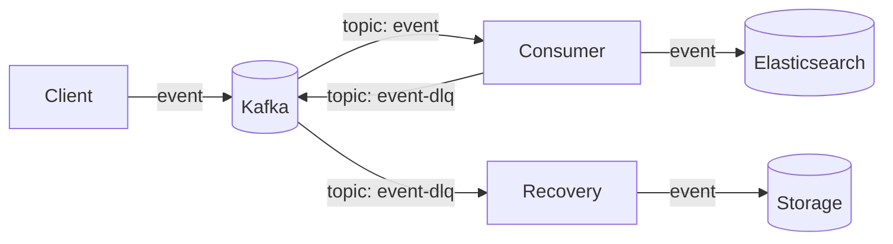

# stradvision-project
Stradvision 과제 수행을 위한 프로젝트입니다.

---
# 사전 준비
## strimzi kafka 설치
### strimzi kafka operator 설치
```bash
# 네임스페이스 생성
$ kubectl create namespace stradvision

# helm chart를 사용하여 strimzi kafka operator 설치
$ helm repo add strimzi https://strimzi.io/charts/
$ helm repo update
$ helm upgrade --install -n stradvision kafka-operator strimzi/strimzi-kafka-operator --version 0.45.0 -f ./middleware/strimzi.yaml

# 생성 확인 (모든 pod의 상태가 Running이면 정상)
$ kubectl get pods -n stradvision
```

### kafka cluster 생성
<span style="color:red; font-weight:bold;">
현재 저의 로컬 환경 리소스를 고려하여 KRAFT 모드로 controller와 broker의 모든 기능을 수행하는 kafka cluster를 생성하였습니다.
</span>

생성된 카프카 스펙은 다음과 같습니다.
* broker role : controller, broker
* broker count : 3
* cpu : 500m
* memory : 1GB
```bash
# kafka cluster 생성 (kraft mode)
# node count: 3, cpu: 1, memory: 1GB
$ kubectl apply -f ./middleware/kafka-cluster.yaml

# 생성 확인 (모든 pod의 상태가 Running이면 정상)
$ kubectl get pods -n stradvision
```

### kafka topic 생성
데이터 처리를 위한 message topic과 데이터 복구를 위한 daed-letter topic을 생성합니다.
```bash
# kafka topic 생성
# topic: stradvision, partition: 3, replication: 2
# dead-letter topic: stradvision-dlq, partition: 3, replication: 1
$ kubectl apply -f ./middleware/kafka-topic.yaml

# 생성 확인
$ kubectl get kafkatopics.kafka.strimzi.io -n stradvision
```

## Elasticsearch 설치
### Elasticsearch 클러스터 설치
elasticsearch 또한 로컬 리소스 상황을 고려하여 master와 data 모든 기능을 수행하는 노드로 구성하였습니다.
생성된 elasticsearch 스펙은 다음과 같습니다.
* node count : 3
* cpu : 500m
* memory : 1GB
* JVM : Xmx=512m, Xms=512m
* nodePort : 30090
```bash
# elasticsearch helm repo 추가
$ helm repo add elastic https://helm.elastic.co
$ helm repo update

# elasticsearch 설치
$ helm upgrade --install --version 8.5.1 -n stradvision elasticsearch elastic/elasticsearch -f ./middleware/elasticsearch.yaml
```

### Elasticsearch Index Template 생성
```bash
$ chmod 777 ./middleware/*.sh
# ilm policy 생성
$ ./middleware/elasticsearch_ilm.sh

# index template 생성
$ ./middleware/elasticsearch_template.sh

# 최초 인덱스 생성
$ ./middleware/elasticsearch_index.sh
```


---
# 과제1
## 아키텍처
`Client`는 Kubernetes api server로 부터 발생된 Event데이터를 수신하여 `Kafka`로 전송합니다. `Consumer`는 `Kafka`로부터 Event데이터를 수신하여 `Elasticsearch`로 전송합니다. `Consumer`는 `Elasitcsearch`에 데이터를 전송하는 도중 실패한 데이터를 `Kafka`의 `event-dlq` topic으로 전송합니다. `Recovery`는 `Kafka`의 `event-dlq` topic으로부터 데이터를 수신하여 `Storage`에 저장합니다.

## 프로젝트 소스 코드 설명
* cmd : 프로그램 application 소스 코드
    * client : Client main 소스 코드
    * consumer : Consumer main 소스 코드
    * recovery : Recovery main 소스 코드
* pkg : 프로그램 application에서 사용하는 패키지 소스 코드
    * kube : kubernetes client 패키지 소스 코드
    * kafka : kafka producer, consumer 패키지 소스 코드
    * elasticsearch : elasticsearch client 패키지 소스 코드
    * storage : storage 패키지 소스 코드
* middleware : kafka, elasticsearch, storage 설정 파일
* manifest : kubernetes yaml 파일
* test : 개발자 테스트 작업
* README.md : 과제1 README 파일

## 프로젝트 실행
빌드
```bash
$ make build
```

workload 실행
```bash
# Recovery 실행
$ kubectl apply -f ./manifest/recovery.yaml

# Consumer 실행
$ kubectl apply -f ./manifest/consumer.yaml

# Client 실행
$ kubectl apply -f ./manifest/client.yaml
```

## 리스크 및 대응
`Consumer` 에서 `Elasticsearch`로 데이터 전송을 실패 할 경우, `Kafka`의 `event-dlq` topic으로 데이터를 전송합니다. `Recovery`는 `Kafka`의 `event-dlq` topic으로부터 데이터를 수신하여 `Storage`에 저장합니다.

## 추후 개선 사항
추후 개선 사항은 리소스 부족 및 시간 부족으로 인해 구현하지 못한 부분입니다.
* `Storage`에 저장된 데이터를 `Elasticsearch`로 전송하는 Workload 구현
* Mirror Maker Kafka Cluster 구성
* Producer, Consumer 모니터링 구성으로 메시지 유실 측정
* Helm Chart로 배포 구성