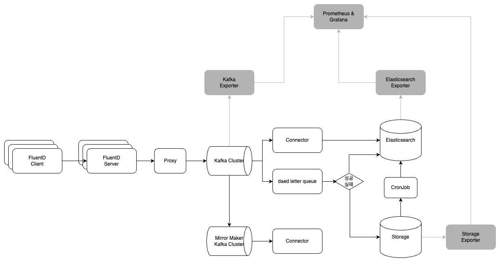

# 과제2
(이번 예제에서는 Fluentd를 이용하였지만 Vector를 사용하여 구현할 수도 있습니다.)

### 1. 로그 수집
Fluentd를 이용하여 로그를 수집하고 Kafka로 전송합니다. 해당 아키텍처에서는 Fluentd Client와 Fluentd Server로 분리하여 구성하였으나 하나의 Fluentd로 구성하여도 무방합니다.
### 2. 로그 전송
Fluentd로 수집된 로그를 Kafka로 전송합니다. 만약 Kafka Cluster에 문제가 발생하면 MirrorMaker를 이용하여 다른 Kafka Cluster로 전송할 수 있습니다.
### 3. 로그 저장
Kafka로 Consume한 로그를 ElasticSearch에 저장합니다. 만약 Elasticsearch Cluster에 문제가 발생하면 dead letter queue를 이용하여 다른 저장소(Storage)로 전송할 수 있습니다.
### 4. 로그 복구
Storage에 저장된 로그를 CronJob을 이용하여 ElasticSearch에 저장합니다.
### 5. 모니터링
각각의 Exporter와 Prometheus를 이용하여 Grafana로 모니터링합니다.


## Kafka Cluster 설계
KRAFT 모드로 구성되어 있으며, Controller와 Broker가 분리하여 클러스터를 구성하였습니다.
```text
# Controller
개수 : 3개 이상의 홀수 개수
CPU : 2Core 이상
Memory : 8GB 이상

# Broker
개수 : 4개 이상의 홀수 개수
CPU : 4Core 이상
Memory : 16GB 이상
```

## ElasticSearch Cluster 설계
Master, Data(Hot), Data(Warm), Data(Cold), Coordinating Node로 구성되어 있습니다.
```text
# Master
개수 : 3개 이상의 홀수 개수
CPU : 2Core 이상
Memory : 8GB 이상

# Data(Hot)
해당 날짜에 수집된 데이터
개수 : 3개 이상
CPU : 8Core 이상
Memory : 32GB 이상
Primary shard : 3개 이상 (노드 개수의 배수)
Replica shard : 2개

# Data(Warm)
수집된지 1일 이상 지난 데이터
개수 : 3개 이상
CPU : 4Core 이상
Memory : 16GB 이상
Primary shard : 3개
Replica shard : 1개

# Data(Cold)
수집된지 7일 이상 지난 데이터
개수 : 1개 이상
CPU : 4Core 이상
Memory : 16GB 이상

# Coordinating Node
개수 : 1개 이상
CPU : 4Core 이상
Memory : 16GB 이상
```
